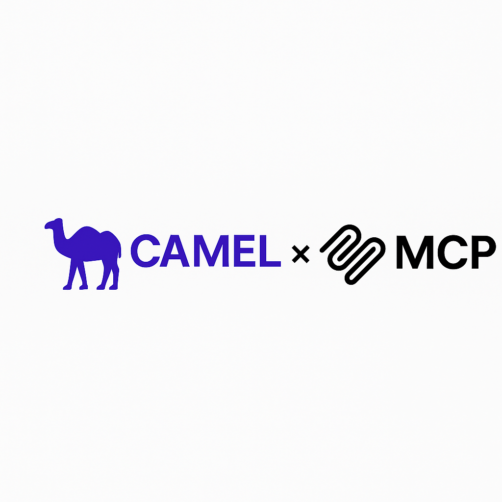

# Camel x MCP: Making AI Agents Accessible to All Tools

*By Xiaotian Jin, Camel-AI*



## Introduction

The world of AI is rapidly evolving, and one of the most exciting developments is the **Model Context Protocol (MCP)** - a groundbreaking standard that promises to revolutionize how AI models interact with external tools and resources. Today, I'm excited to share how Camel, our multi-agent framework, is embracing MCP to create more powerful, flexible, and interoperable AI systems.

## What is MCP and Why Does It Matter?

The Model Context Protocol (MCP) is a standardized way for AI models to communicate with external tools and resources using JSON-RPC 2.0. But to understand why MCP is so important, let's first look at the history of function calling in AI systems.

### The Evolution of Function Calling

**Pre-2023**: In the early days, LLMs had no native ability to use external tools. Developers had to rely on creative prompt engineering and parse unstructured model outputs to create any semblance of tool use. Frameworks like LangChain and Camel provided some structure, but the process was error-prone and inconsistent.

**June 2023**: OpenAI made a significant leap forward by introducing native function calling in GPT-4 and GPT-3.5-turbo. This feature used structured JSON outputs to call tools and pass arguments, making tool integration more reliable and scalable.

**November 2024**: Anthropic proposed the Model Context Protocol (MCP), formalizing tool interaction using JSON-RPC 2.0 and standardizing how AI systems communicate with external tools and resources.

**2025**: MCP gained industry-wide adoption, with major players like OpenAI and DeepMind implementing the standard. Function calling became a core capability for advanced agentic AI systems.

### Why Standardization Matters

MCP solves a critical problem in the AI ecosystem - the lack of standardization in how models interact with external tools. Before MCP, developers had to create custom integrations for each model and tool combination, leading to fragmentation and unnecessary complexity.

With MCP, we have a universal language that enables any MCP-compatible model to seamlessly interact with any MCP-compatible tool. This dramatically reduces development overhead and enables greater innovation in the AI ecosystem.

## How Does MCP Work?

The MCP ecosystem consists of three main components:

1. **MCP Hosts**: These are the deployment environments for AI systems, such as Claude Desktop App or Camel agents. Hosts provide the runtime environment for AI models to execute.

2. **MCP Clients**: These internal protocol engines handle sending and receiving JSON-RPC messages between the model and external tools.

3. **MCP Servers**: These programs receive incoming messages from clients, process them, and return structured responses. They encapsulate the actual functionality of external tools.

The beauty of this architecture is its simplicity and flexibility. Any tool can be wrapped as an MCP server, making it instantly accessible to any MCP-compatible AI system.

## The Growing MCP Ecosystem

The MCP ecosystem is growing rapidly, with several platforms providing access to MCP servers:

- [Smithery](https://smithery.ai)
- [Composio](https://composio.dev/)
- [mcp.run](https://mcp.run/)
- [ACI.dev](https://www.aci.dev)
- [ModelScope](https://www.modelscope.cn/mcp)
- [Awesome MCP Servers](https://github.com/punkpeye/awesome-mcp-servers)

Each of these platforms offers a variety of tools that can be easily integrated with any MCP-compatible model.

## Camel's Integration with MCP

At Camel, we're fully embracing MCP to enhance our multi-agent framework. Here's how we're integrating MCP into our ecosystem:

### Basic Tool Integration in Camel

Even before MCP, Camel had robust support for tool integration. Here's a simple example of how we can integrate a custom function as a tool:

```python
from camel.toolkits import FunctionTool

def my_weird_add(a: int, b: int) -> int:
    """Adds two numbers and includes a constant offset.
    Args:
        a (int): The first number to be added.
        b (int): The second number to be added.
    Returns:
        integer: The sum of the two numbers plus 7.
    """
    return a + b + 7

agent = ChatAgent(
    tools=[FunctionTool(my_weird_add)]
)

response = agent.step("What is 15+15")
print(response.msgs[0].content)
```

But with MCP, we can take this to the next level.

### Using MCP Tools in Camel

Integrating MCP tools into Camel is straightforward. Here's how you can use a Time MCP server with a Camel agent:

First, set up your MCP server configuration:

```json
{
  "mcpServers": {
    "time": {
      "command": "uvx",
      "args": ["mcp-server-time", "--local-timezone=Asia/Riyadh"]
    }
  }
}
```

Then, use the MCPToolkit to connect to your server and make its tools available to your agent:

```python
import asyncio
from camel.toolkits.mcp_toolkit import MCPToolkit, MCPClient

async def run_time_example():
    # Initialize the MCPToolkit with your configuration file
    mcp_toolkit = MCPToolkit(config_path="config/time.json")
    # Connect to all configured MCP servers
    await mcp_toolkit.connect()
    camel_agent = ChatAgent(
        model=model,
        tools=[*mcp_toolkit.get_tools()],
    )
    response = await camel_agent.astep("What time is it now?")
    print(response.msgs[0].content)
    print(response.info['tool_calls'])
    # Disconnect from all servers
    await mcp_toolkit.disconnect()
await run_time_example()
```

### Creating MCP Servers from Camel Toolkits

One of the most exciting features of our MCP integration is the ability to turn any Camel toolkit into an MCP server. This means that any tool you build in Camel can be easily shared with the broader AI ecosystem.

Here's how you can turn the ArxivToolkit into an MCP server:

```python
# arxiv_toolkit_server.py
import argparse
import sys
from camel.toolkits import ArxivToolkit

if __name__ == "__main__":
    parser = argparse.ArgumentParser(
        description="Run Arxiv Toolkit in MCP server mode.",
        usage=f"python {sys.argv[0]} [--mode MODE]",
    )
    parser.add_argument(
        "--mode",
        choices=["stdio", "sse"],
        default="stdio",
        help="MCP server mode (default: 'stdio')",
    )
    parser.add_argument(
        "--timeout",
        type=float,
        default=None,
        help="Timeout for the MCP server (default: None)",
    )
    args = parser.parse_args()
    toolkit = ArxivToolkit(timeout=args.timeout)
    # Run the toolkit as an MCP server
    toolkit.mcp.run(args.mode)
```

### Discovering MCP Servers

We've also developed tools to help you discover existing MCP servers. Our PulseMCPSearchToolkit makes it easy to find the right tool for your needs:

```python
search_toolkit = PulseMCPSearchToolkit()
search_toolkit.search_mcp_servers(
    query="Slack",
    package_registry="npm",  # Only search for servers registered in npm
    top_k=1,
)
```

This returns detailed information about available Slack MCP servers, including their capabilities, documentation, and usage statistics.

### MCP Search Agents

To make MCP server discovery even easier, we've created MCPAgent, which can dynamically search for and integrate MCP servers based on your queries:

```python
from camel.agents import MCPAgent, MCPRegistryConfig, MCPRegistryType 
smithery_config = MCPRegistryConfig(
  type=MCPRegistryType.SMITHERY, 
  api_key=os.getenv("SMITHERY_API_KEY")
)

# Create MCPAgent with registry configurations
agent = MCPAgent(
  model=model,
  registry_configs=[smithery_config]
)

async with agent:
    response = await agent.astep("What MCP tools can I use for connecting to Gmail?")
    print(response.msgs[0].content)
```

This agent can search for relevant MCP servers, explain their capabilities, and even execute queries using them. For example, asking about Gmail tools would return information about various Google Workspace servers, while a query about Camel-AI would search the web and return comprehensive information about our organization.

### Camel Agents as MCP Servers

Perhaps most excitingly, we're making it possible to expose Camel agents themselves as MCP servers. This means you can create specialized agents for different tasks and make them available to any MCP-compatible model:

```python
# Create a default chat agent
chat_agent = ChatAgent()
chat_agent_description = "A general-purpose assistant that can answer questions and help with various tasks."

# Create a reasoning agent
reasoning_agent = ChatAgent(
    model=ModelFactory.create(
        model_platform=ModelPlatformType.OPENAI,
        model_type="gpt-4o-mini",
    )
)
reasoning_agent_description = "A specialized assistant focused on logical reasoning and problem-solving."

# Create a search agent
search_agent = ChatAgent(
    model=ModelFactory.create(
        model_platform=ModelPlatformType.OPENAI,
        model_type="gpt-4o",
    ),
    tools=[FunctionTool(SearchToolkit().search_brave)],
)
search_agent_description = "A research assistant capable of retrieving information from the web."

# Define your agent dictionary
agents_dict = {
    "general": chat_agent,
    "search": search_agent,
    "reasoning": reasoning_agent,
}

# Add descriptions
description_dict = {
    "general": chat_agent_description,
    "search": search_agent_description,
    "reasoning": reasoning_agent_description,
}
```

These agents can then be exposed as MCP servers, allowing other systems to leverage their specialized capabilities.

## Integrating with Claude Desktop

You can also use Claude Desktop to interact with your Camel agents by providing the proper configuration:

```json
"camel-chat-agent": {
  "command": "/Users/jinx0a/micromamba/bin/python",
  "args": [
    "/Users/jinx0a/Repo/camel/services/agent_mcp_server.py"
  ],
  "env": {
    "OPENAI_API_KEY": "...",
    "OPENROUTER_API_KEY": "...",
    "BRAVE_API_KEY": "..."
  }
}
```

This configuration allows Claude to seamlessly interact with your Camel agents, creating a powerful hybrid AI system that combines the strengths of both platforms.

## Future Developments

We're continuously working to enhance our MCP integration. Here are some of the developments we're excited about:

- **MCP Search Agents**: We're expanding our integration to more MCP registries, including Composio, to give you access to a wider range of tools.
- **MCP Hub**: We're building our own repository of validated MCP servers to ensure high-quality, reliable tools for our community.
- **Role-Playing/Workforce as MCP Servers**: We're transforming Camel's multi-agent module into MCP servers, allowing for more complex agent interactions and workflows.

## Conclusion

MCP represents a significant step forward in the evolution of AI systems. By standardizing how models interact with external tools, MCP is making AI more powerful, flexible, and accessible than ever before.

At Camel, we're fully embracing this standard and building powerful integrations that leverage the full potential of MCP. Whether you're using existing MCP servers, creating your own, or turning Camel agents into MCP servers, our framework provides the tools you need to build cutting-edge AI systems.

We invite you to join us on this journey and explore the exciting possibilities that MCP opens up for AI development.

## Connect with Camel-AI

- [CAMEL-AI](https://camel-ai.org)
- [GitHub: camel-ai/camel](https://github.com/camel-ai/camel)
- [Documentation](https://docs.camel-ai.org/)
- [Discord Community](https://discord.gg/CNcNpquyDc)

## Resources

- [MCP Examples](https://github.com/camel-ai/camel/tree/master/examples/mcp)
- [Model Context Protocol](https://modelprotocol.org) 